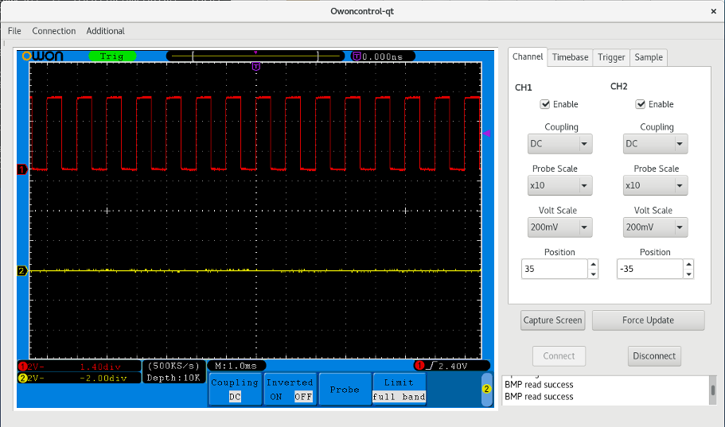

# owoncontrol-qt
Owon oscilloscope USB interface in QT

This is the next step from my "owoncontrol" project and provides a simple
user interface for the end user to allow control of an SDS7102v oscilloscope
via USB.

This has been created using qt-creator and has a dependancy on libusb.

Whilst functional there are a couple of known functions that do not have
any effect.

I have added the ability to take screen captures from the oscilloscope
thanks to the work done by bjohnh. Reference project available here:

https://github.com/bjonnh/owon-sds7102-protocol

The only thing that is missing more than anything is the ability to have a
live update. I think it is possible to get raw data from the scope to
display traces on the screen but at this moment in time I am unsure of the
way to tackle it.

Build
-----
Requires qt development files and libusb.

Goto the root directory and run qmake to generate a makefile.
Run make to build.

Additional
----------
The application will need to be run as root otherwise it will be unable to
access the oscilloscope via usb.

LAN Settings
------------

The SDS7102v has LAN support.......(Very poor lan support).

The lan side of the oscilloscope has no method of announcing itself to a
router. It has a fixed IP address and a random MAC address that can be 
adjusted in the scope settings.

My router rejected the default MAC address in the scope so I had to find
a valid MAC address of one of the devices on my network and increment the
last hex value to get it to accept.

I then had to go one step further and use ARP within my router to assign a
permanent IP to the newly created MAC.

After all of this I could ping the scope BUT 50% of the transmitted packets
were lost. I suspect this might be related to duplex mismatch...

I gave up at this point and switched to using a crossover cable with fixed
IP addresses. This works very well and results in no packet loss and
a good solid connection.

Fixed IP address (PC) : 192.168.1.71
Fixed Subnet (PC) : 255.255.255.0
Fixed Gateway (PC) : 192.168.1.1

Scope IP : 192.168.1.72
Scope Subnet : 255.255.255.0
Scope Gateway : 192.168.1.1
Scope MAC : See Description Above

Disclaimer
----------
Use this software at your own risk. Whilst it should not be possible to 
damage any hardware as a result of using this tool, it has not undergone
any rigorous testing and software bugs can and will exist.
